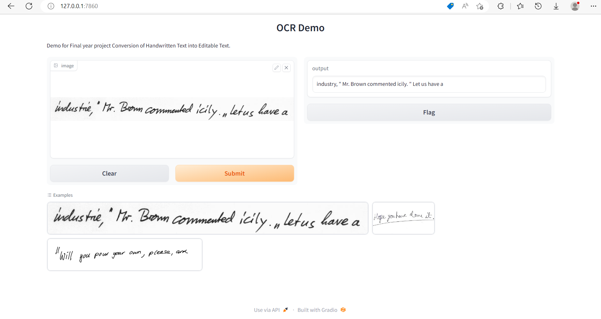

# Conversion-of-Handwritten-Text-to-Editable-Text

To test the project follw the steps

**1.**  Clone the project.

```
https://github.com/saravana611/Conversion-of-Handwritten-Text-to-Editable-Text.git
```
**2.** Navigate to the project directory.

```
cd Conversion-of-Handwritten-Text-to-Editable-Text
```
**3.** Install the dependencies.

```
pip install -r requirements-demo.txt
```

**4.** Open terminal and run the demo ocr file

```
python demo_ocr.py
```

**4.** Navigate to the web Address

```
 http://127.0.0.1:7860
```
**5.** That's it you can test your handwritten lines like this




## Thank you
